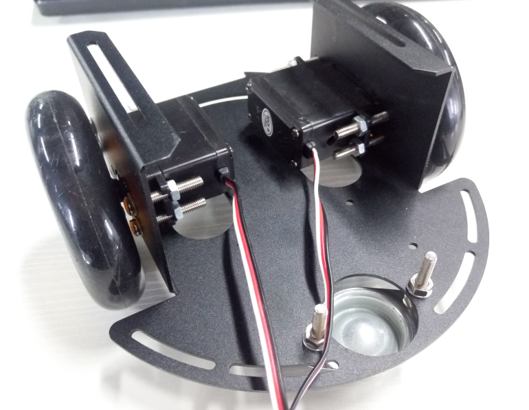
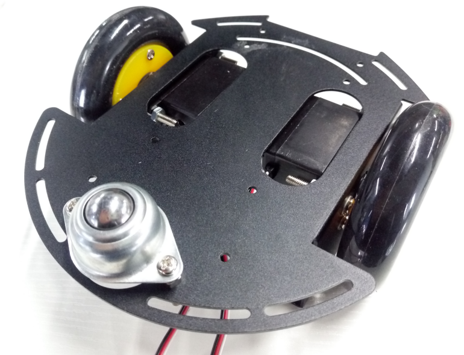
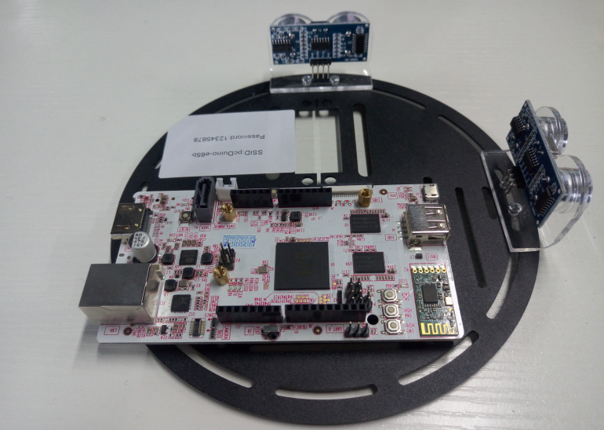
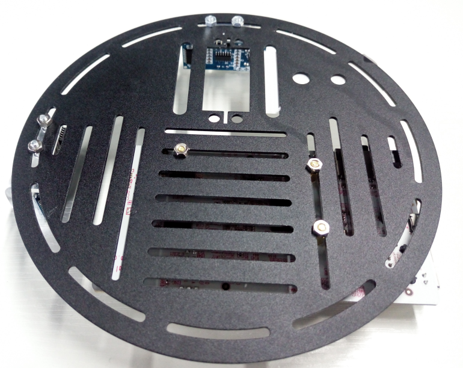
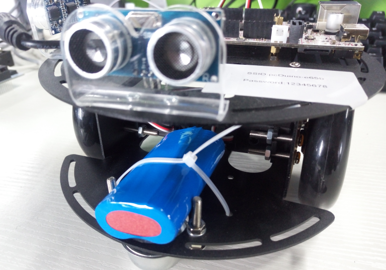
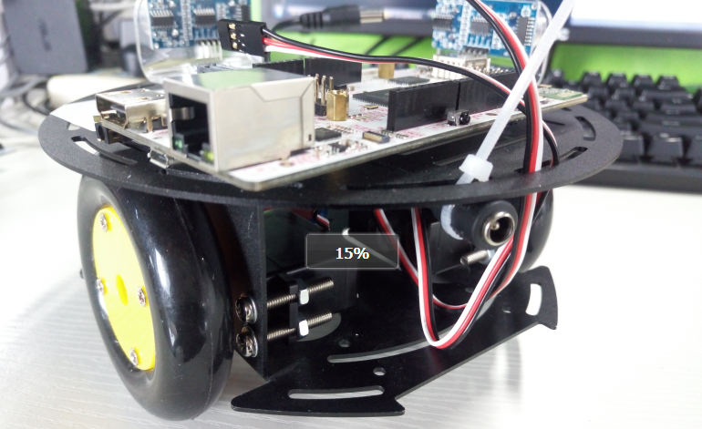
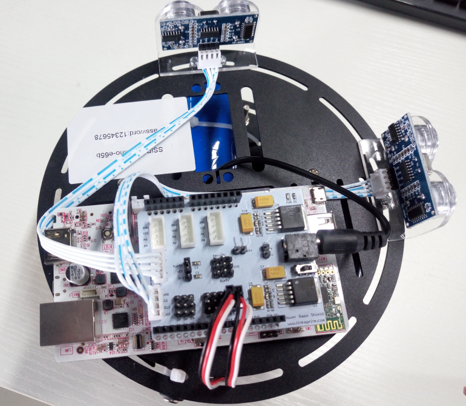

# pcDuino Robot组装教程

### 1.底板的组装

* 将两个伺服电机通过螺丝固定在底盘
* 安装伺服电机上面的轮子，通络螺丝固定在电机上
* 安装万向轮，注意万向轮与两个驱动轮高度一致，可能需要添加垫片

### 2.托盘的组装

* 将pcDuino3B固定在托盘上，通过三个螺丝铜柱
* 将两个超声波支架以及超声波固定在托盘上，用两个螺丝固定
* 将标签纸贴在托盘的空闲位置

###### 备注：超声波传感器的位置分别是一个在前面，一个在右边

### 整体的组装

* 将底盘和托盘通过两个螺丝固定在一起，注意前后（万向轮是前）
* 将电池固定在万向轮一端，通过扎带
* 电池的充电口通过扎带固定在托盘

### 接线

* 将Power Base Shield接在pcDuino3B上
* 将超声波传感器接到Power Base Shield
* 将伺服电机接到Power Base Shield
* 将电池电源输出口接到Power Base Shield 电源输入口

###### 超声波传感器接线对应

| Ultrasonic Front | Power Base Shield |
| ---------------- | -----------------:|
| VCC              | VCC               |
| Trig             | D13               |
| Echo             | D3                |
| GND              | GND               |

| Ultrasonic Right | Power Base Shield |
| ---------------- | -----------------:|
| VCC              | VCC               |
| Trig             | D12               |
| Echo             | D2                |
| GND              | GND               |

###### 伺服电机接线对应

| Servo Left      | Power Base Shield |
| ---------------- | -----------------:|
| Black            | GND               |
| Red              | Servo5V           |
| White            | D11               |

| Servo Right       | Power Base Shield |
| ---------------- | -----------------:|
| Black            | GND               |
| Red              | Servo5V           |
| White            | D10               |

###### 接线完成确认无误后，方可打开电源开关，此时可以看到pcDuino3B上的灯在闪烁，过一会便可以发现一个WiFi名为pcDuino-xxxx。
###### pcDuino Robot [组装视频教程](https://youtu.be/2mjQVTMJZtc)

