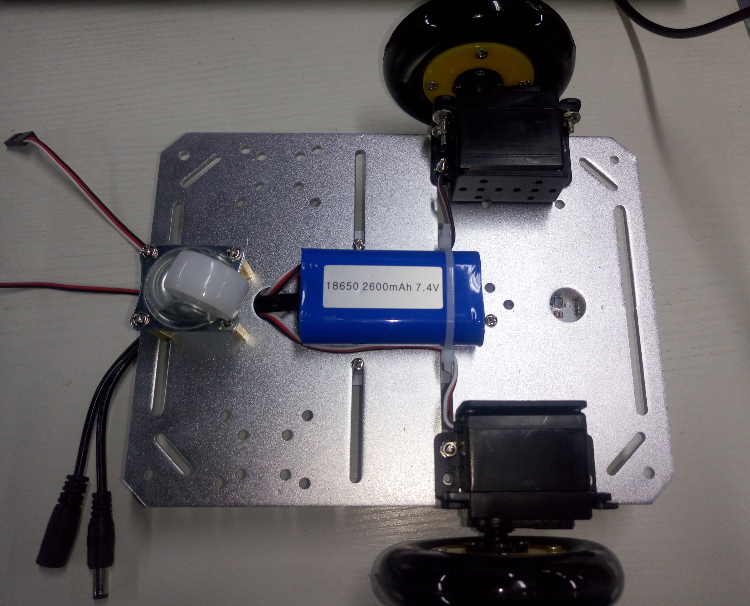
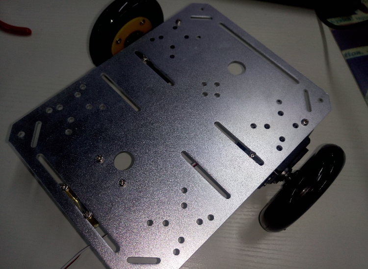
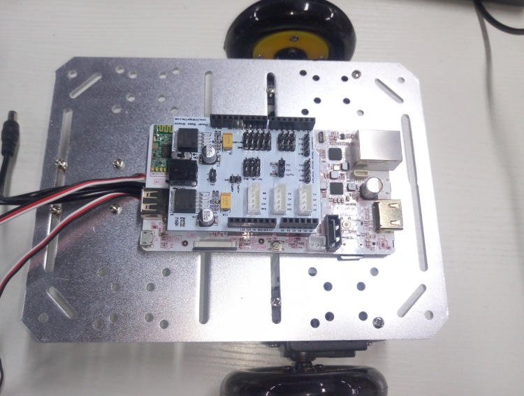
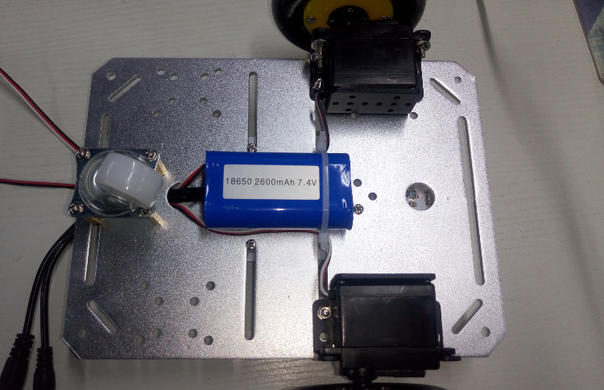
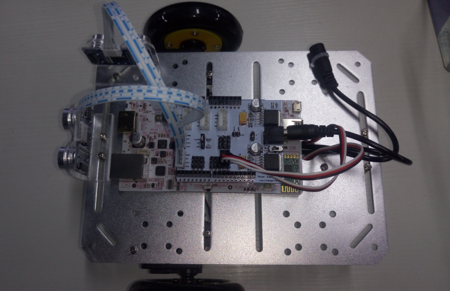

## Introduction to pcDuino Robot assembly

### 1.Chassis assembly

* Secure the two servo motors to the chassis with screws
* Secure the wheels to the servo motors with screws
* Secure the caster to the chassis with screws

###### Note:The caster and the two wheels should be at the same height，and you need to add shims if necessary.

Use the following pictures to check whether the installation is correct.

### 2.Pallet assembly

* Use three copper studs to attach the pcDuino3B to the pallet
* The Ultrasonic Sensor has been installed on the bracket, so you just need to secure the two ultrasonic brackets to the pallet
* Stick the label to a free position of the pallet

###### Note: The two ultrasonic sensors should be placed at the front and right respectively.

Check whether the installation is correct according to the following pictures.

### Complete Robot assembly

* Use two screws to secure the chassis and the pallet together.

###### Note that the caster points to the front.

* Secure the battery to the caster side with a cable tie as the following picture

* Secure the charging port of the battery to the pallet with a cable tie

### Wiring

* Connect the Power Base Shield to the pcDuino3B

* Connect the ultrasonic sensor to the Power Base Shield according to the following tables

Use the following pictures to check your wiring.

| Ultrasonic Front | Power Base Shield |
| ---------------- | -----------------:|
| VCC              | VCC               |
| Trig             | D13               |
| Echo             | D3                |
| GND              | GND               |

| Ultrasonic Right | Power Base Shield |
| ---------------- | -----------------:|
| VCC              | VCC               |
| Trig             | D12               |
| Echo             | D2                |
| GND              | GND               |

* Connect the servo motors to the Power Base Shield according to the following tables

| Servo Left      | Power Base Shield |
| ---------------- | -----------------:|
| Black            | GND               |
| Red              | Servo5V           |
| White            | D11               |

| Servo Right       | Power Base Shield |
| ---------------- | -----------------:|
| Black            | GND               |
| Red              | Servo5V           |
| White            | D10               |

* Connect the battery power output to the Power Base Shield power input

Use the following pictures to check your wiring.

When the wiring is complete, launch the pcDuino Robot, wait for the indicator light of the Wi-Fi module lighting up. After a while the Robot will automatically create a Wi-Fi Hotspot named pcDuino-xxxx.

If you want to watch the assembly video, click [PcDuino Robot assembly video tutorial](https://youtu.be/2mjQVTMJZtc)

